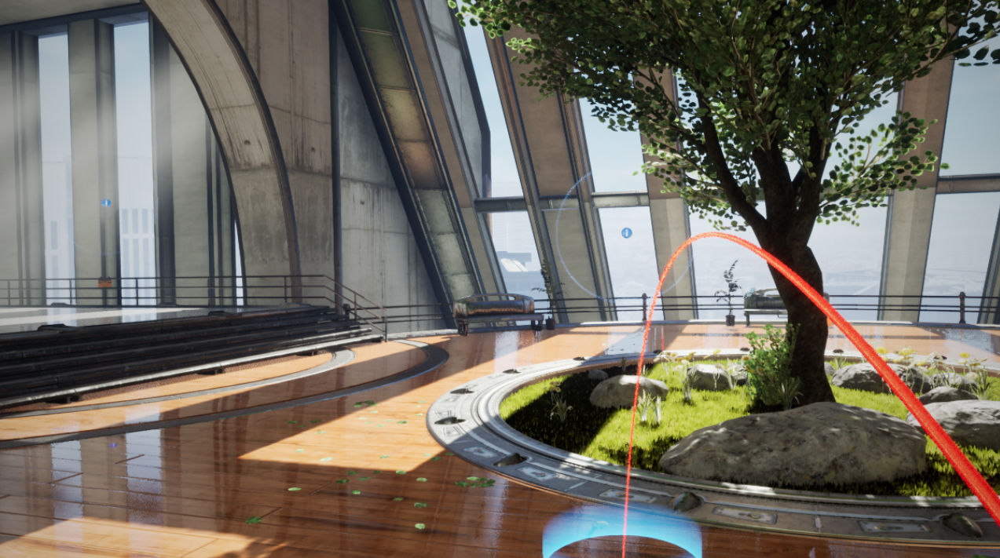

# Architecture Explorer

This is a demo meant to learn and practice implementing VR movement concepts in C++ in Unreal Engine 4.

## Movement features implemented
- Teleportation with parabolic arc preview
- Joystick movement with "blinkers"
- Snap Turning
- Climbing

## Note
This project was created by following along with [this tutorial from gamedev.tv](https://www.gamedev.tv/p/unrealvr)